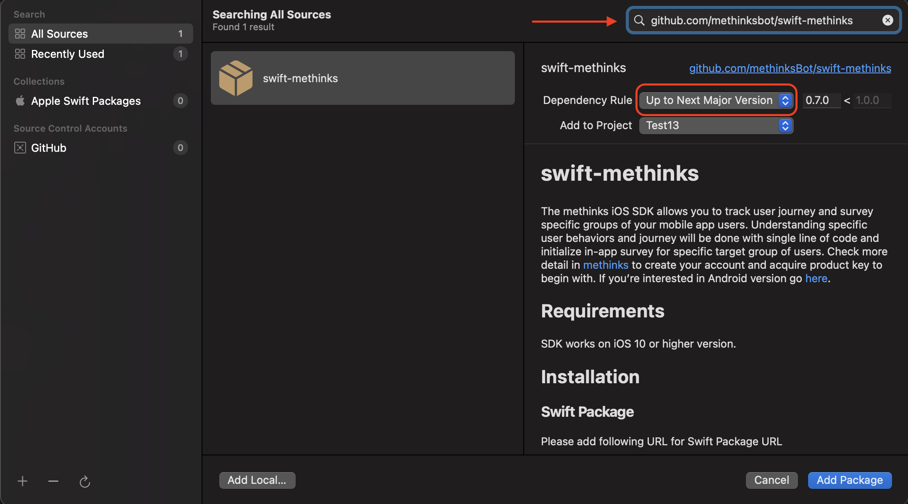

# swift-methinks

methinks iOS SDK는 당신의 모바일을 앱을 사용하는 유저들의 행동을 트랙킹, 분석하고 적절하 순간에 in-app survey를 할 수 있게 해주는 SDK입니다. 구체적이 내용은 [methinks](https://www.methinks.io) 에서 확인하시고 사인업 후 clientKey와 productKey를 발급 받아 사용할 수 있습니다. 안드로이드 버전은 [여기](https://www.methinks.io)를 참고하세요.
<br>
## 버전 요구 사항

methinks iOS SDK는 최소 iOS 10 또는 상위 버전에서 작동합니다. 
<br>
## 인스톨

### Swift Package로 설치

아래 URL을 Swift Package 로 선택하여 설치할 수 있습니다. 
```
https://github.com/methinksBot/swift-methinks
```





## 기본 셋업

인스톨을 시작하 전 `clientKey`와 `productKey`를 [methinks](https://www.methinks.io)에서 발급 받았는지 확인해 주십시오.
methinks iOS SDK는 앱의 라이프 사이클이 시작될 때 initialize 해야 하며 `AppDelegate` 클래스에서 아래와 같이 initialize를 진행합니다.  

`autoTracking`을 `true`로 세팅하 자동을 유저 행동 패턴 수집을 시작합니다.  

Swift:
```swift
import methinksSDK_iOS

func application(_ application: UIApplication, didFinishLaunchingWithOptions launchOptions: [UIApplication.LaunchOptionsKey: Any]?) -> Bool {

  MTKSDK.shared().initialize(withClientKey: "YOUR CLIENT KEY", productKey: "YOUR PRODUCT KEY", autoTracking: true)

  return true
}
```

Obj-C:
```objc
#import <methinksiOS/MTKSDK.h>

- (BOOL)application:(UIApplication *)application didFinishLaunchingWithOptions:(NSDictionary *)launchOptions {

  [[MTKSDK shared] initializeWithClientKey:@"myClientKey" productKey:@"x12345" autoTracking:YES];

return YES;
}
```
<br>

## 유저 행동 트랙킹
methinks SDK는 유저가 탭이나 터치 이벤트를 진행하는 `UIViewController` 클래스를 기반으로 유저의 행동 패턴을 트랙킹합니다. `autoTracking`으로 자동으로 트랙킹할 수 있으며 아래 몇가지 옵션을 향상되고 정확하게 트랙킹할 수 있습니다. 

<br>

### ViewController 커스텀 타이틀
`autoTracking`이 설정되어 있으면 SDK는 `UIViewController`의 파일 이름을 기반을 이름을 수집합니다. 해당 이름이 복잡하거나 어려우 경우, 쉽게 인지하고 이해할 수 있는 이름으로 변경하여 트랙킹할 수 있습니다. 이 코드는 유저가 `viewController`와 상호 작용을 하기 전에 실행하는 것이 좋으며 `viewDidAppear:` 을 권장합니다. 

Swift:
```swift
  override func viewDidAppear(_ animated: Bool) {
    super.viewDidAppear(animated)
    MTKSDK.shared().setViewController(self, withCustomTitle: "UserOptionSettingView")
  }
  ```

Obj-C:
```objc
- (void)viewDidAppear:(BOOL)animated {
    [super viewDidAppear:animated];
    [[MTKSDK shared] setViewController:self withCustomTitle:@"OptionSettionView"];
} 
```

<br>

### 중요하지만 ViewController 클래스가 아닌 view 트래킹
앱이 `UIViewController` 베이스가 아니거나 하나의 `viewController`에서 여러개의 중요한 `view`를 사용하는 경우, `SwiftUI`의 `UIHostingController`를 사용하는 경우 등에서는 수동으로 트랙킹하려는 view를 추가할 수 있습니다. 해당 트랙킹하려는 view가 완전히 `visible`해지기 전에 호출하는 것을 권합니다.  

Swift:
```swift
  MTKSDK.shared().setCustomTrackingViewTitle("OptionSettingView")
```

Obj-C:
```objc
  [[MTKSDK shared] setCustomTrackingViewTitle:@"OptionSettingView"];
```
<br>

### 특정 view를 트랙킹하지 않기
유저의 행동 패턴 분석에 도움이 안되거나 의미없는 `viewController`의 경우 특정한 `UIViewController`를 `autoTracking`에서 제외 시킬 수 있습니다.  from auto tracking if the viewController is meaningless in user journey. 이 코드는 유저가 `viewController`와 상호 작용을 하기 전에 실행하는 것이 좋으며 `viewDidAppear:` 을 권장합니다.  

Swift:
```swift
  override func viewDidAppear(_ animated: Bool) {
    super.viewDidAppear(animated)
    MTKSDK.shared().disableViewTracking()
  }
```

Obj-C:
```objc
- (void)viewDidAppear:(BOOL)animated {
    [super viewDidAppear:animated];
    [[MTKSDK shared] disableViewTracking];
} 
```
<br>
<br>

methinks SDK는 대시보드 표시를 위해 트랙킹하는 `view` 당 1장의 스크린샷을 저장합니다. 모든 스크린의 스크린을 저장하면, 더 이상 스크린샷을 찍지 않으며, 아주 최초의 앱 사용자의 스크린만 저장합니다. 다만 이러한 대표 스크린샷 역시 유저의 민감한 정보를 포함하고 있다면 해당 `view`를 **sensitive**로 설정하여 스크린샷을 저장하지 않습니다. 이 경우에도 해당 뷰는 계속 트랙킹됩니다. 이 코드는 유저가 `viewController`와 상호 작용을 하기 전에 실행하는 것이 좋으며 `viewDidAppear:` 을 권장합니다.  

Swift:
```swift
  override func viewDidAppear(_ animated: Bool) {
    super.viewDidAppear(animated)
    MTKSDK.shared().setAsSensitiveScreen()
  }
```

Obj-C:
```objc
- (void)viewDidAppear:(BOOL)animated {
    [super viewDidAppear:animated];
    [[MTKSDK shared] setAsSensitiveScreen];
} 
```

<br>

## In-App 서베이
methinks SDK는 모바일에 최적화된 in-app 서베이 기능을 제공합니다. 해당 in-app 서베이는 UX에 저해되지 않는 방식으로 유저들의 의견을 실시간으로 수집할 수 있습니다.  
서베이의 작성과 실시간 응답 분석은 [methinks](https://www.methinks.io)에서 더 자세히 확인할 수 있습니다.

<br>

### 어디에서 in-app 서베이를 보여줄 지 결정
기본값으로 in-app 서베이는 유저가 시작하는 새로운 세션의 시작 부분에서 보여지며 이는 methinks SDK를 언제 initiate하느냐에 따라 달라질 수 있습니다. 다만 앱의 시작 부분에서 유저들이 중요한 정보를 취득해야 하거나 액션이 필요한 경우 서베이가 보여지는 위치를 변경할 수 있습니다. 이 경우에는 서베이가 보여져야 하는 `viewController`를 만든 이후 바로 지정할 수 있습니다.  

Swift:
```swift
  let homeVC = HomeViewController()
  MTKSDK.shared().setDefaultSurveyViewController(homeVC)
```

Obj-C:
```objc
  HomeViewController* homeVC = [[HomeViewController alloc] init];
  [[MTKSDK shared] setDefaultSurveyViewController:homeVC];
```

<br>

## 사용자와 연계 (in-app 서베이, 행동 패턴 분석)
in-app 서베이와 행동 패턴 분석의 결과를 보다 더 자세히 이해하기 위해서 사용자 특유의 정보와 methinks SDK를 연결하십시오. DB에서 인지할 수 있는 유니크한 유저ID를 연결하여 두면 해당 유저의 행동 패턴이나 타겟화된 in-app 서베이를 진행할 수 있습니다. 

Swift:
```swift
  MTKSDK.shared().setUserId:"X1234567"
```

Obj-C:
```objc
  [[MTKSDK shared] setUserId:@"X1234567"];
```
  <br>
  <br>
  
유저와 관련하여 좀 더 자세한 attributes들을 어카운트와 연동시켜 둘 수 있습니다. 예를 들어 여성 유저들에게만 in-app 서베이를 진행하고자 한다면, methinks SDK를 통해 해당 유저의 성별 정보를 연경 시켜 둘 수 있습니다.  더 많은 유저의 정보를 `key-value` 조합으로 입력할 수 있습니다. `value`는 숫자 또는 문자열이 될 수 있습니다.   

Swift:
```swift
  MTKSDK.shared().setUserAttribute("gender", value: "female")
```

Obj-C:
```objc
  [[MTKSDK shared] setUserAttribute:@"gender" value:@"female"];
```

